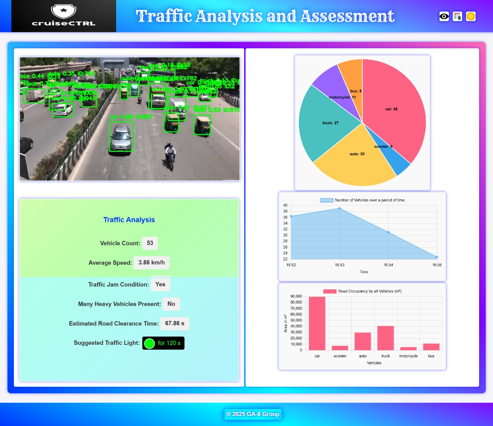

Here’s a draft of your `README.md` file for **cruiseCTRL**:  

---
🚦 Intelligent Traffic Perception System

🌟 Overview

Our Intelligent Traffic Perception System is designed to revolutionize traffic monitoring, optimize road safety, and enhance real-time decision-making. By integrating object detection (YOLOv8), lane segmentation (UNet), and tracking (DeepSORT), our system provides actionable insights for smart cities. 🚗🛣️

🏎️ Features

1️⃣ Multi-Class Detection 🔍

🚗 🚶‍♂️ 🏍️ 🚌 🚦Utilizing YOLOv8, our system detects and classifies multiple road entities, including:

Cars

Pedestrians

Bikes

Buses

Traffic Signals

This enables real-time monitoring, ensuring better road safety and traffic management. 🏁

2️⃣ Lane Detection & Analysis 🛣️

Using advanced lane segmentation (UNet), our system identifies and tracks lane usage:

Detects lane boundaries 🏎️

Counts vehicles per lane 🚘

Analyzes traffic congestion patterns 📊

Example: On a 4-lane road, our system identifies how many vehicles are in each lane, optimizing road efficiency. 📍

3️⃣ Lane Segmentation & Context Awareness 🌍

Unlike simple lane detection, our detailed lane segmentation helps in:

Understanding intersections, merges, and roundabouts 🔄

Identifying vehicles drifting out of their lanes 🚨

Detecting illegal pedestrian crossings 🚶‍♂️❌

This ensures precise lane-based decision-making for improved safety. 🛑

4️⃣ Dynamic Route Optimization 🗺️

Our system analyzes real-time traffic data to recommend the shortest and safest routes:

Detects congestion & obstacles 🚦

Suggests alternate routes to avoid delays 🚗➡️

Improves overall travel efficiency 🏁

5️⃣ Real-Time Dashboard 📊🎛️

A Python-based dashboard provides live insights:
✅ Live Traffic Feeds 📹✅ Lane-Wise Vehicle Counts 🚗📊✅ Traffic Density Heatmaps 🔥✅ Lane Departure & Violation Alerts 🚨

🏆 Why Choose Our System? 🎯

✅ Comprehensive Detection: Tracks all road users with multi-class detection.✅ Advanced Lane Analysis: Segmentation & tracking provide deep traffic insights.✅ Dynamic Optimization: AI-powered route suggestions reduce congestion.✅ User-Friendly Dashboard: Real-time monitoring simplifies traffic management.

🔬 Technology Stack ⚙️

Object Detection: YOLOv8 🏎️

Lane Segmentation: UNet 🎯

Tracking: DeepSORT 🔄

Enhanced Accuracy: Transformer-based attention modules ⚡

🚀 Let's Build the Future of Transportation! 🏗️

This Intelligent Traffic Perception System is a step towards smarter, safer, and more efficient roads. Join us in redefining traffic management and enhancing urban mobility! 🌆🛣️

📩 Contact us for collaboration and further insights! 🚀



## 🚀 Key Features  

### 1. Multi-Task Learning  
- Combines **object detection (YOLOv8)**, **lane segmentation (UNet)**, and **tracking (DeepSORT)** into a unified model.  
- Improves **efficiency and context-awareness** for autonomous driving scenarios.  

### 2. Attention Mechanisms  
- Enhances **YOLOv8** with **Transformer-based attention modules**.  
- Boosts detection accuracy, especially for **small or occluded objects** in complex environments.  

### 3. Robustness Under Diverse Conditions  
- Implements **synthetic data augmentation** techniques (fog, rain, night conditions).  
- Ensures reliable performance across **varying lighting, weather, and traffic scenarios**.  

## 🛠️ Installation  

1. Clone the repository:  
   ```bash
   git clone https://github.com/your-repo/cruiseCTRL.git
   cd cruiseCTRL
   ```  
2. Install dependencies:  
   ```bash
   pip install -r requirements.txt
   ```  

## 🏎️ Usage  

To run the model on a video stream:  
```bash
python main.py --source your_video.mp4 --model yolo_unet_deepsort
```  

## 📜 License  
This project is licensed under the **MIT License**.  

---  

Let me know if you want any modifications! 🚀
